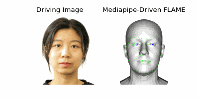
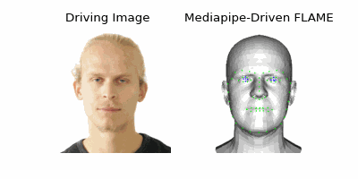
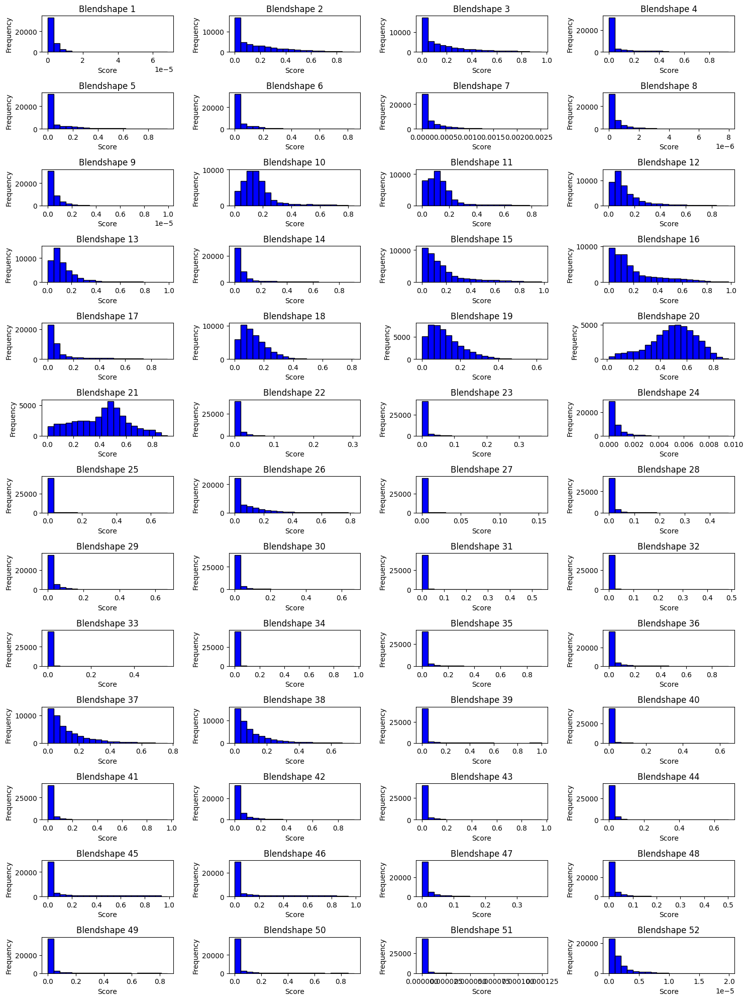
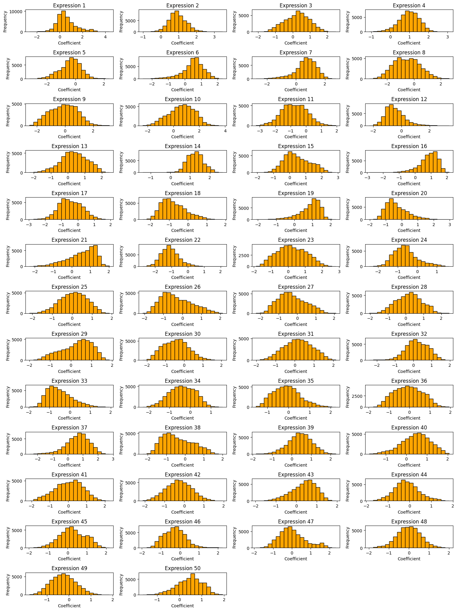
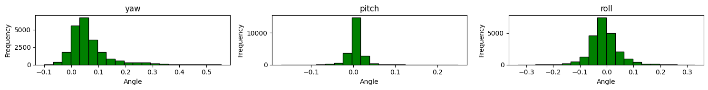
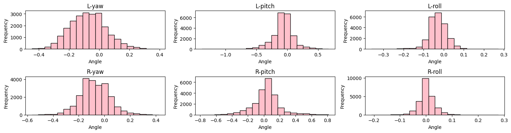

# Real-time Mediapipe-based FLAME Animation Driver

Mapping **Mediapipe**'s 52 blendshapes to **FLAME**'s 50 expression coefficients and poses (jaw and eyeballs).

This can be used to drive the FLAME mesh using Mediapipe in **real-time**.


## 🔑 Method

We use both public datasets (NerSemble, IMAvatar) and our own data. First, we estimate the FLAME model coefficients (expression, pose, and eye pose) along with Mediapipe blendshape scores for each image. We then compute the linear mappings using [```./compute_mappings.ipynb```](./compute_mappings.ipynb).


## ⚖️ Disclaimer

This code and the associated mapping weights are provided for research and educational purposes only. Since public datasets were utilized in the development of the mapping weights, these weights may not be used for commercial purposes without obtaining the necessary rights. For commercial use, we recommend collecting and training on your own dataset to ensure compliance with legal and licensing requirements.

This code and the weights are provided "as-is" without any express or implied warranties, including, but not limited to, implied warranties of merchantability and fitness for a particular purpose. We make no guarantees regarding the accuracy, reliability, or fitness of the code and weights for any specific use. Use of this code and weights is entirely at your own risk, and we shall not be liable for any claims, damages, or liabilities arising from their use.


## ✨ Examples





## 🧸 How to Use

```
from mp_2_flame import MP_2_FLAME
mp2flame = MP_2_FLAME(mappings_path='./mappings')

# blendshape_scores is the np.array object with shape [N,52],
# N is the number of samples, and by default N=1
exp, pose, eye_pose = mp2flame.convert(blendshape_scores=blendshape_scores)
```


## 🥕 Data Distributions

Following are distrubution histograms of the data we use to calculate the mappings.

### Mediapipe Blendshape Scores 😌



### FLAME Expression Coefficients 😃



### FLAME Jaw Pose 😮



### FLAME Eyeballs Pose 👁️👁️




